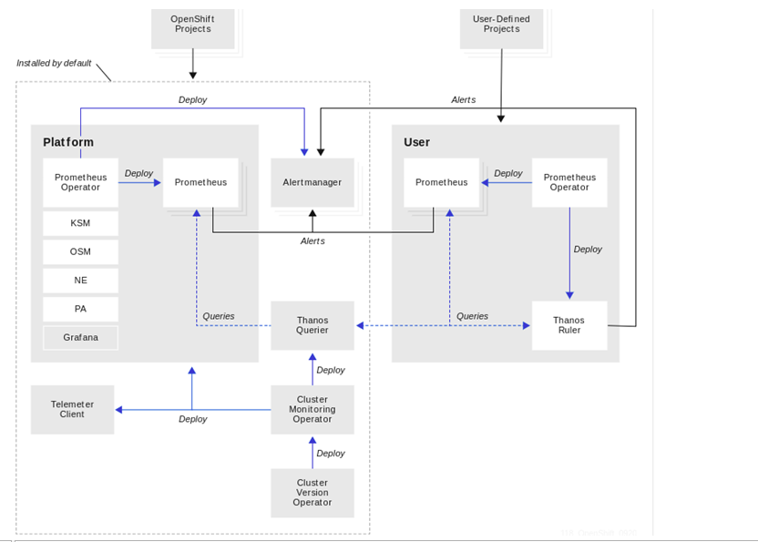
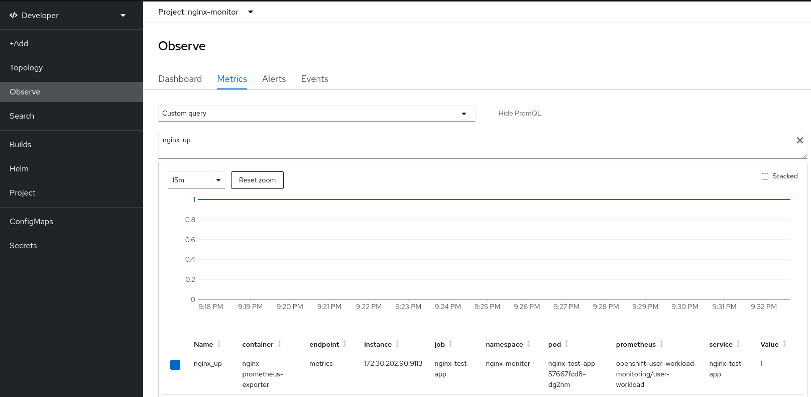
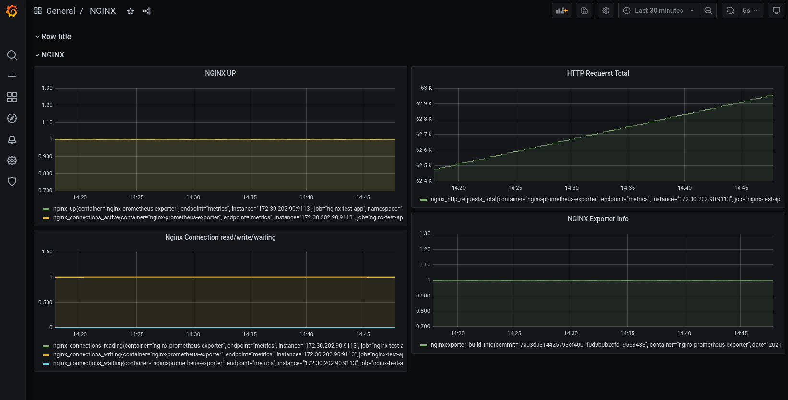

= Getting Information about Monitoring RHOCP 
ifdef::localdir[]
:OLDlocaldir: {localdir}
:localdir: ./Chapter-Ansible/
endif::localdir[]
ifndef::localdir[]
:localdir: ./
:copyright: (C) 2022 IBM
:orgname: IBM
:toc: right
:title-page:
:data-uri:
:sectnums:
:sectnumlevels: 4
:toclevels: 4
:allow-uri-read: true
:doctype: article
:source-highlighter: rouge
:icons: font
:pdf-page-size: A4
:pdf-stylesdir: lib/themes
:pdf-style: ibm-theme.yml
:pdf-fontsdir: lib/fonts
:listing-caption: Listing
:ibm-classification:
:title-logo-image: image::images/Chapter-Ansible-6d90d.png[pdfwidth=4in,align=right]
endif::localdir[]
:imagesdir: {localdir}

Author: Juergen Statnik <juergen.statnik@de.ibm.com>

[abstract]
--
[quote, John Delaney]
____
“The way you deal with automation is by upgrading people's skills so they can get the jobs of the future.”
____
--

== OCP 4.9 Monitoring

=== Enabling User Monitorings and Test container
---
RedHat Access-infopage: link:https://access.redhat.com/documentation/en-us/openshift_container_platform/4.10/html-single/monitoring/index#configuring-the-monitoring-stack[access.red.hat] +
RedHat OCP-Page: link:https://docs.openshift.com/container-platform/4.10/monitoring/monitoring-overview.html[OCP Doku] 
---

https://access.redhat.com/documentation/en-us/openshift_container_platform/4.9/html/monitoring/configuring-the-monitoring-stack[OPC4.9 Monitoring link]

=== Monitoring overview
Default platform monitoring components -> openshift-monitoring project

Components for monitoring user-defined projects -> openshift-user-workload-monitoring

==== Prometheus Overview Components
[#img#prometheus]
.Overview Prometheus Componets

Grafana dashboard is read-only 

==== Default Targets 
* CoreDNS
* Elasticsearch (if Logging is installed)
* etcd
* Fluentd (if Logging is installed)
* HAProxy
* Image registry
* Kubelets
* Kubernetes API server
* Kubernetes controller manager
* Kubernetes scheduler
* Metering (if Metering is installed)
* OpenShift API server
* OpenShift Controller Manager
* Operator Lifecycle Manager (OLM) 

==== Monitoring targets for user-defined projects
When monitoring is enabled for user-defined projects, you can monitor:

* Metrics provided through service endpoints in user-defined projects.
* Pods running in user-defined projects.

===  Configuring the monitoring stack 

https://access.redhat.com/documentation/en-us/openshift_container_platform/4.9/html-single/scalability_and_performance/#scaling-cluster-monitoring-operator[Prerequistes - Scaling the Cluster Monitoring Operator]

==== Creating a cluster monitoring config map
create the cluster-monitoring-config ConfigMap object in the openshift-monitoring project +

$ oc -n openshift-monitoring get configmap cluster-monitoring-config

[source,yaml]
----
apiVersion: v1
kind: ConfigMap
metadata:
  name: cluster-monitoring-config
  namespace: openshift-monitoring
data:
  config.yaml: |
----

$ oc apply -f cluster-monitoring-config.yaml

==== Creating a user-defined workload monitoring config map
create the user-workload-monitoring-config ConfigMap object in the openshift-user-workload-monitoring project +

* Prerequisites +
** You have access to the cluster as a user with the cluster-admin role. +
** You have installed the OpenShift CLI (oc). +

$ oc -n openshift-monitoring get configmap user-workload-monitoring-config

`oc apply -f conf_monitor_stack/cluster-monitoring-config.yaml`

[source,yaml]
----
apiVersion: v1
kind: ConfigMap
metadata:
  name: user-workload-monitoring-config
  namespace: openshift-user-workload-monitoring
data:
  config.yaml: |
    prometheus: 
      retention: 24h 
      resources:
        requests:
          cpu: 200m 
          memory: 2Gi 
----

`$ oc apply -f conf_monitor_stack/user-workload-monitoring-config.yaml`

==== Enable user defined projects: 
`enableUserWorkload: true`

[source,yaml]
----
metadata:
  name: cluster-monitoring-config
  namespace: openshift-monitoring
data:
  config.yaml: |
    prometheusK8s:
      retention: 24h
    enableUserWorkload: true
    alertmanagerMain:
      enableUserAlertmanagerConfig: true
----

==== Check ob Enabled 

`oc apply -f conf_monitor_stack/enable_workload_cluster-monitoring-config.yaml`

`$ oc get pods -n openshift-user-workload-monitoring`

----
NAME                                   READY   STATUS    RESTARTS   AGE
prometheus-operator-75d67487b4-8d8td   2/2     Running   0          36h
prometheus-user-workload-0             5/5     Running   0          30h
prometheus-user-workload-1             5/5     Running   0          30h
thanos-ruler-user-workload-0           3/3     Running   0          36h
thanos-ruler-user-workload-1           3/3     Running   0          36h

----
=== Get metrics from pods 

To get metrics this could be happen on two ways: 

==== First is using the Prometheus client libs inside the pod 

Enable Prometheus in the Spring Boot app.

Adding further dependencies for Spring Boot makes the application ready for exposing Prometheus metrics through a new endpoint: /actuator/prometheus.

The following example shows the Spring Boot 2.x pom.xml file with Prometheus dependencies:

----
 <dependency>
   <groupId>org.springframework.boot</groupId>
   <artifactId>spring-boot-starter-actuator</artifactId>
 </dependency>

 <!-- Prometheus Support with Micrometer -->
 <dependency>
   <groupId>io.micrometer</groupId>
   <artifactId>micrometer-core</artifactId>
 </dependency>

 <dependency>
   <groupId>io.micrometer</groupId>
   <artifactId>micrometer-registry-prometheus</artifactId>
 </dependency>
----

By default prometheus endpoint is not available and must be enabled in application.properties. More configurations 
can be found at spring-boot https://docs.spring.io/spring-boot/docs/current/reference/htmlsingle/#actuator.metrics.export.prometheu[docs]

----
#Metrics related configurations
management.endpoint.metrics.enabled=true
management.endpoints.web.exposure.include=*
management.endpoint.prometheus.enabled=true
management.metrics.export.prometheus.enabled=true
management.metrics.distribution.percentiles-histogram.http.server.requests=true
management.metrics.distribution.sla.http.server.requests=1ms,5ms
management.metrics.distribution.percentiles.http.server.requests=0.5,0.9,0.95,0.99,0.999
----

After you start up, you can reach the new endpoint at localhost:8080/actuator/prometheus.

See the following example from Prometheus endpoint:

----
 # HELP tomcat_global_received_bytes_total
 # TYPE tomcat_global_received_bytes_total counter
 tomcat_global_received_bytes_total{name="http-nio-8080",} 0.0
 # HELP tomcat_sessions_rejected_sessions_total
 # TYPE tomcat_sessions_rejected_sessions_total counter
 tomcat_sessions_rejected_sessions_total 0.0
 # HELP jvm_threads_states_threads The current number of threads having NEW state
 # TYPE jvm_threads_states_threads gauge
 jvm_threads_states_threads{state="runnable",} 7.0
 jvm_threads_states_threads{state="blocked",} 0.0
 jvm_threads_states_threads{state="waiting",} 12.0
 jvm_threads_states_threads{state="timed-waiting",} 4.0
 jvm_threads_states_threads{state="new",} 0.0
 jvm_threads_states_threads{state="terminated",} 0.0
 # HELP logback_events_total Number of error level events that made it to the logs
 # TYPE logback_events_total counter
 logback_events_total{level="warn",} 0.0
 logback_events_total{level="debug",} 0.0
 logback_events_total{level="error",} 0.0
 logback_events_total{level="trace",} 0.0
 logback_events_total{level="info",} 11.0
 # HELP jvm_gc_pause_seconds Time spent in GC pause
 # TYPE jvm_gc_pause_seconds summary
 jvm_gc_pause_seconds_count{action="end of major GC",cause="Metadata GC Threshold",} 1.0
 jvm_gc_pause_seconds_sum{action="end of major GC",cause="Metadata GC Threshold",} 0.046
 jvm_gc_pause_seconds_count{action="end of minor GC",cause="Metadata GC Threshold",} 1.0
 ...
----

==== Create custom metrics

Integrating Prometheus libraries in Spring Boot results in a base set of metrics. If you need custom metrics, you can create your own metrics.

Metrics are uniquely identified by name and tags. The tags allow multiple views per dimension on the same metric. The following basic metrics are commonly supported:

Counter: A single metric, the count.

Timer: A metric for short-duration latency and frequency of the occurrence of an event (at minimum, including the total and county information).

Gauge: A metric that represents the current value, such as collection size.

The following code listing displays the counter integration for a Spring Boot REST endpoint. It is a Java snippet for Spring Boot plus the meter and Prometheus support with two counters:
----
@RestController
@RequestMapping("/data/v1")
public class DataRest {

  // Metric Counter to collect the amount of Echo calls
    private Counter reqEchoCounter;

  // Metric Counter to collect the amount of Timestamp calls
    private Counter reqTimestampCounter;

    public DataRest(final MeterRegistry registry) {

    // Register the Countere with a metric named and different tags
        reqEchoCounter = registry.counter("data_rest", "usecase", "echo");
        reqTimestampCounter = registry.counter("data_rest", "usecase", "timestamp");
    }

    @ApiOperation(value = "Delivers the given string back; like an Echo service.", response = String.class)
    @GetMapping("/echo/{val}")
    public String simpleEcho(@PathVariable(value = "val") String val) {

        reqEchoCounter.increment();
        return String.format("Data: {%s}", val);
    }

    @ApiOperation(value = "Delivers the given string with the current timestamp (long) back; like an Echo service.", response = String.class)
    @GetMapping("/timestamp/{val}")
    public String simpleEchoWithTimestamp(@PathVariable(value = "val") String val) {

        reqTimestampCounter.increment();
        return String.format("Data: %d - {%s}", System.currentTimeMillis(), val);
    }
}
----

The following code listing shows the result from the Prometheus endpoint with the two new counters:

----
# HELP data_rest_total
# TYPE data_rest_total counter
data_rest_total{usecase="echo",} 10.0
data_rest_total{usecase="timestamp",} 0.0
...
----

`How using this metrics for Grafana will be shown in the nginx example with nginx_up and nginx_connections_... ` 

Second use an Exporter container to get the application metrics - this solution is done with nginx example 

=== Using test pod to see user metrics with exporter container 

Helm chart to install nginx test container :

https://github.ibm.com/juergen-statnik/RHOCP/tree/main/test_userworkload/nginx[helm chart to install nginx]

define project:

`oc new-project nginx-monitor` 

`helm install nginx . --dry-run` to see what happens + 

`helm install nginx .`  

After this installation metrics are visible in Observe -> Metrics -> nginx_up ( RUN QUERIES ) as Administrator 

As Developer you have to choose Observe -> Metrics and ENTER your custom metrics `nginx_up`

=== Using Grafana to view nginx metrics

==== Deploying Custom Grafana

Install Grafana Grafana Operator in own namespace -> nginx-monitor

===== Create Instance

----
apiVersion: integreatly.org/v1alpha1
kind: Grafana
metadata:
  name: nginx-grafana
  namespace: nginx-monitor
----

===== Connecting Prometheus to our Custom Grafana

----
oc adm policy add-cluster-role-to-user cluster-monitoring-view -z grafana-serviceaccount +
oc adm policy add-cluster-role-to-user view -z grafana-serviceaccount +

oc serviceaccounts get-token grafana-serviceaccount -n nginx-monitor +
 GET THE BEARER_TOKEN +
----

===== Data Source 

----
apiVersion: integreatly.org/v1alpha1
kind: GrafanaDataSource
metadata:
  name: prometheus-grafanadatasource
  namespace: nginx-monitor 
spec:
  datasources:
    - access: proxy
      editable: true
      isDefault: true
      jsonData:
        httpHeaderName1: 'Authorization'
        timeInterval: 5s
        tlsSkipVerify: true
      name: Prometheus
      secureJsonData:
        httpHeaderValue1: 'Bearer ${BEARER_TOKEN}'
      type: prometheus
      url: 'https://thanos-querier.openshift-monitoring.svc.cluster.local:9091'
  name: prometheus-grafanadatasource.yaml
---- 

==== Get User and Password from Custom-Grafana

oc get secret -n <my-grafana-ns>

oc get secret grafana-admin-credentials -o yaml -n <my-grafana-ns>

----
data:
  GF_SECURITY_ADMIN_PASSWORD: MWxfMmg0NzN0X2lXXXXXX==
  GF_SECURITY_ADMIN_USER: YWRtaW4=
 echo "YWRtaW4=" | base64 --decode                   >> admin
 echo "MWxfMmg0NzN0X2lXXXXXX==" | base64 --decode   >> 1l_2.......
----

==== Create route for Grafana console login: 

----
oc get route -n nginx-monitor 
oc expose svc grafana-service -n nginx-monitor 

oc get route grafana-service -n nginx-monitor
---- 
get url for conole-login or open inside Openshift Console 

==== Grafana Dashboard 

